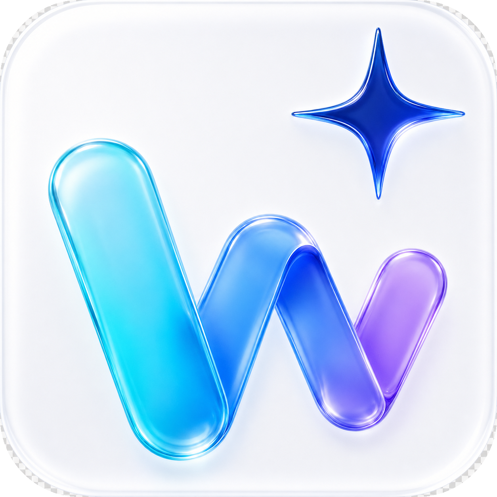
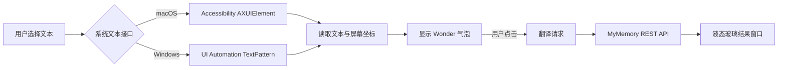

# Wonder

Wonder 是一款常驻 macOS 菜单栏和 Windows 系统托盘的原生划词翻译工具。选中任意单词或句子后，Wonder 会在选区附近显示一个轻量气泡；点击气泡即可查看翻译。翻译窗口采用半透明液态玻璃风格，支持拖动、复制和点击外部关闭，尽量不打断当前工作流。

<p align="center">
  
</p>

<p align="center">
  <strong>macOS · Windows · 免费翻译 · 后台常驻 · 隐私优先</strong>
</p>

> 当前版本：**0.5.2**。提供 Apple Silicon macOS 安装包与 64 位 Windows 单文件程序。

## 功能一览

- **全局划词翻译**：在支持辅助功能文本的应用中选择单词或句子，选区下方出现 Wonder 气泡。
- **轻量液态玻璃窗口**：窗口紧凑、可拖动，支持点击窗口外自动关闭，不遮挡更多内容。
- **原文与译文复制**：原文区域和译文区域都提供复制按钮。
- **菜单栏 / 系统托盘常驻**：不占用 Dock 或任务栏主空间，随时暂停监听、打开设置或退出。
- **免费翻译接口**：默认使用 MyMemory REST API，不需要 OpenAI Key 或其他模型密钥。
- **多语言选择**：支持自动检测，以及简体中文、繁体中文、美式英语、英式英语、日语、韩语、法语、德语、西班牙语、俄语、意大利语和葡萄牙语等。
- **菜单栏快捷翻译**：macOS 左键点击 Wonder 图标即可打开输入翻译界面；输入停止后自动翻译，无需点击“翻译”按钮。
- **可调设置**：选区读取方式、响应延迟、气泡大小与位置、玻璃主题、译文字号、是否显示原文和开机启动。
- **安全读取策略**：优先读取系统辅助功能 / UI Automation；必要时使用短暂剪贴板兜底，并在读取后恢复原剪贴板内容。

## 下载与运行

### macOS（Apple Silicon）

选择一种安装包：

- [下载 DMG 安装镜像](https://github.com/komako22/Wonder/releases/download/v0.5.2/Wonder-v0.5.2-macOS-arm64.dmg)
- [下载 APP ZIP 压缩包](https://github.com/komako22/Wonder/releases/download/v0.5.2/Wonder-v0.5.2-macOS-arm64.zip)

打开 DMG 后将 `Wonder.app` 拖入“应用程序”；如果下载 ZIP，请先解压再移动应用。首次使用划词功能时，请在：

**系统设置 → 隐私与安全性 → 辅助功能**

中允许 Wonder 控制电脑。Wonder 不会主动索要系统密码，也不会把辅助功能权限当作翻译接口密钥。

当前安装包使用开发测试签名，尚未经过 Apple 公证。如果 macOS 阻止打开，请前往“系统设置 → 隐私与安全性”，在安全提示下选择“仍要打开”。正式公开分发建议使用 Apple Developer ID 签名和公证。

### Windows

下载适用于 Intel/AMD 64 位 Windows 的自包含单文件程序：

[下载 Wonder-v0.5.2-windows-x64.exe](https://github.com/komako22/Wonder/releases/download/v0.5.2/Wonder-v0.5.2-windows-x64.exe)

程序无需预装 .NET 8，也不需要管理员权限，启动后会出现在系统托盘。当前 EXE 尚未使用商业代码签名证书，Windows SmartScreen 可能显示“未知发布者”；请确认文件来自本仓库的 Release 页面。

如需从源码运行，请在 Windows 10 1903+ 或 Windows 11 上安装 .NET 8 SDK：

```powershell
cd windows
dotnet build Wonder.Windows.sln -c Release
dotnet run --project GlassTranslate.Windows -c Release
```

生成单文件发布包：

```powershell
./scripts/publish.ps1
```

产物位于：

```text
windows/artifacts/win-x64/Wonder.exe
```

## 从源码构建 macOS

要求：

- macOS 13 或更高版本
- Swift 6
- Xcode 或 Xcode Command Line Tools

```bash
cd macos
swift build
./scripts/build-app.sh
open .build/Wonder.app
```

构建脚本会完成以下工作：

1. 编译 Swift 原生程序；
2. 组装 `Wonder.app`；
3. 写入应用图标和菜单栏资源；
4. 使用本地开发签名进行签名，保持辅助功能授权在源码重建后尽量稳定。

构建结果：

```text
macos/.build/Wonder.app
```

检查源码和资源：

```bash
./scripts/check-source.sh
```

说明：仅安装 Command Line Tools 的机器可以完成 `swift build` 和应用构建；`swift test` 需要完整 Xcode 提供的 XCTest 模块。

## 使用方法

1. 启动 Wonder，让它保持在菜单栏或系统托盘中运行。
2. 在浏览器、编辑器、办公软件等支持系统文本访问的应用中拖动选择文本。
3. 松开鼠标，等待选区附近出现 Wonder 气泡。
4. 点击气泡，查看原文和译文；点击复制按钮复制对应内容。
5. 点击翻译窗口外部即可关闭窗口；顶部细拖动条可以把窗口移动到屏幕任意位置。
6. 通过菜单栏 / 系统托盘菜单进入设置、暂停监听或退出应用。

macOS 还可以左键点击菜单栏 Wonder 图标打开快捷翻译窗口。输入文字后，停止输入约半秒，Wonder 会自动请求翻译；可在窗口顶部切换源语言和目标语言。

## 隐私与权限

Wonder 的设计目标是“只在用户明确点击后翻译”：

- 仅在检测到文本选择、且用户点击气泡后，才向 MyMemory 发送选中文本；
- 不使用 OpenAI 兼容接口，不要求模型 API Key，不读取系统钥匙串中的 OpenAI 密钥；
- 翻译历史不会持久化保存；
- 语言偏好和可选的 MyMemory 联系邮箱保存在本地设置中；
- 辅助功能权限只用于读取当前选区和定位气泡，不用于录屏；
- 对密码框和安全输入控件会主动跳过；
- 剪贴板兜底读取完成后会恢复原剪贴板内容。

MyMemory 是第三方免费翻译服务。使用免费接口时，选中文本会发送到 MyMemory 服务器，具体数据保留和服务条款请以其官方政策为准。对敏感内容，请不要使用在线翻译服务。

## 已知限制

- 画布渲染、图片文字、部分 PDF 阅读器、游戏、远程桌面，以及主动屏蔽 Accessibility / UI Automation 的应用，可能无法提供可读取的选区。
- 当前免费接口受第三方服务速率和字符额度限制；长文本会被分段处理，但仍可能受到服务端限制。
- macOS 发布包面向 Apple Silicon（arm64）。Intel Mac 可尝试从源码构建，但未提供预编译包。
- Windows 源码构建必须在 Windows 环境中完成，因为 WPF 和 Windows UI Automation 依赖 Windows Desktop SDK；普通用户可直接下载自包含 EXE。
- 当前版本没有真正的逐 token 网络流式翻译；输入翻译窗口采用防抖自动请求，避免每次按键都发送请求。

## 项目结构

```text
Wonder/
├── .github/workflows/              # GitHub Release 自动构建与发布
├── assets/                         # Wonder 图标母版
├── docs/                           # 架构说明
├── macos/                          # Swift + AppKit + SwiftUI
│   ├── Sources/GlassTranslate/     # 菜单栏、划词监听、翻译窗口和设置
│   ├── Resources/                  # Info.plist、icns 和图标资源
│   └── scripts/                    # 构建与本地签名脚本
├── windows/                        # C# + WPF + Windows UI Automation
│   ├── GlassTranslate.Windows/     # 托盘、监听、气泡、结果窗口和设置
│   └── scripts/                    # Windows 发布脚本
├── releases/                       # macOS 历史构建包
└── scripts/check-source.sh         # 静态检查脚本
```

## 技术架构



macOS 使用 Swift、AppKit、SwiftUI 和 ApplicationServices；Windows 使用 C#、WPF、Windows Forms NotifyIcon 和 UI Automation。完整设计说明见 [docs/ARCHITECTURE.md](docs/ARCHITECTURE.md)。

## 贡献与反馈

欢迎提交 Issue，建议附上以下信息：

- 操作系统版本和 CPU 架构；
- Wonder 版本；
- 发生问题的应用名称；
- 是否已授予辅助功能 / UI Automation 权限；
- 复现步骤和终端日志（请先移除隐私文本）。

如果你希望贡献代码，请尽量保持 macOS 与 Windows 的交互行为一致，并避免提交个人签名证书、密钥、邮箱或构建产物中的敏感信息。

## 许可证

当前仓库尚未附带正式 `LICENSE` 文件。除非后续补充许可证，代码和资源默认保留所有权利；欢迎先通过 Issue 讨论授权方式和贡献规范。
